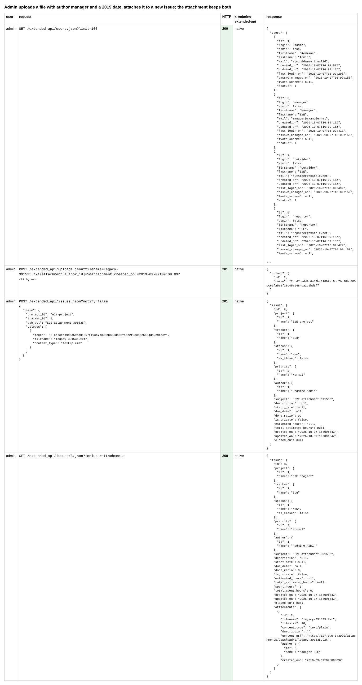
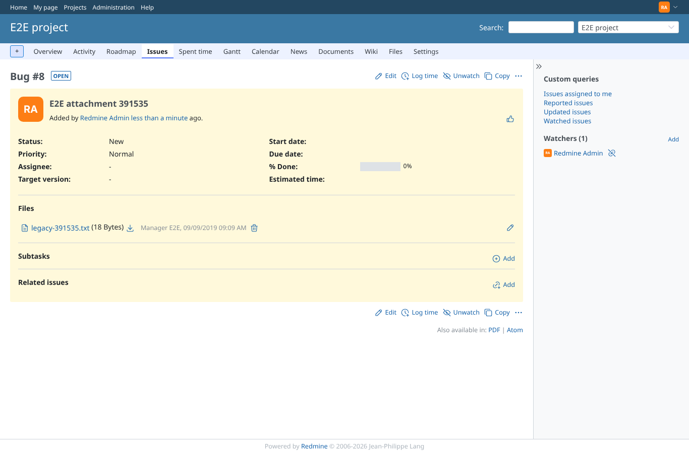
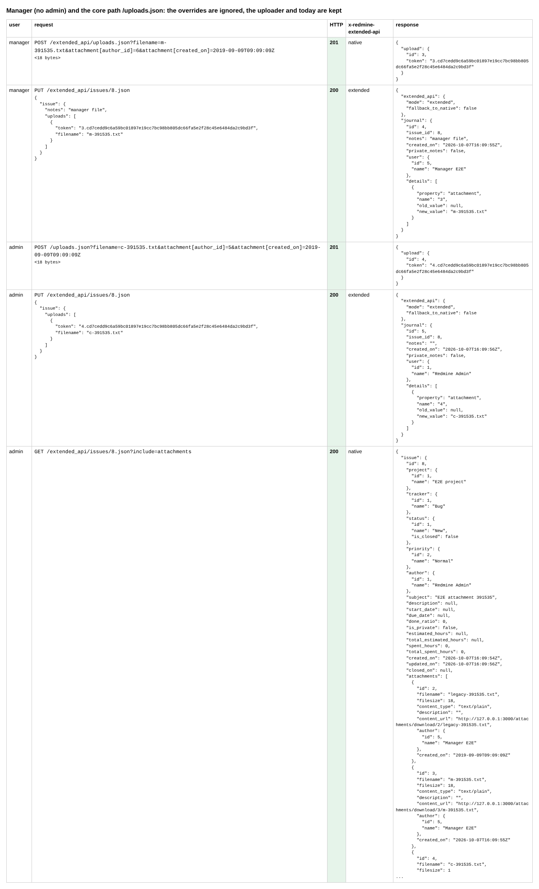
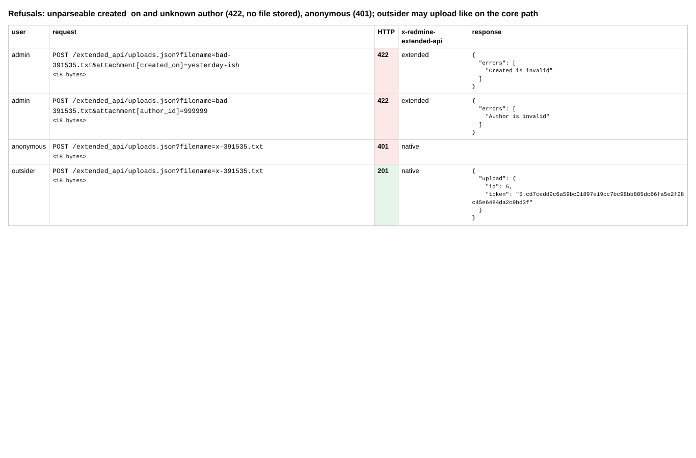
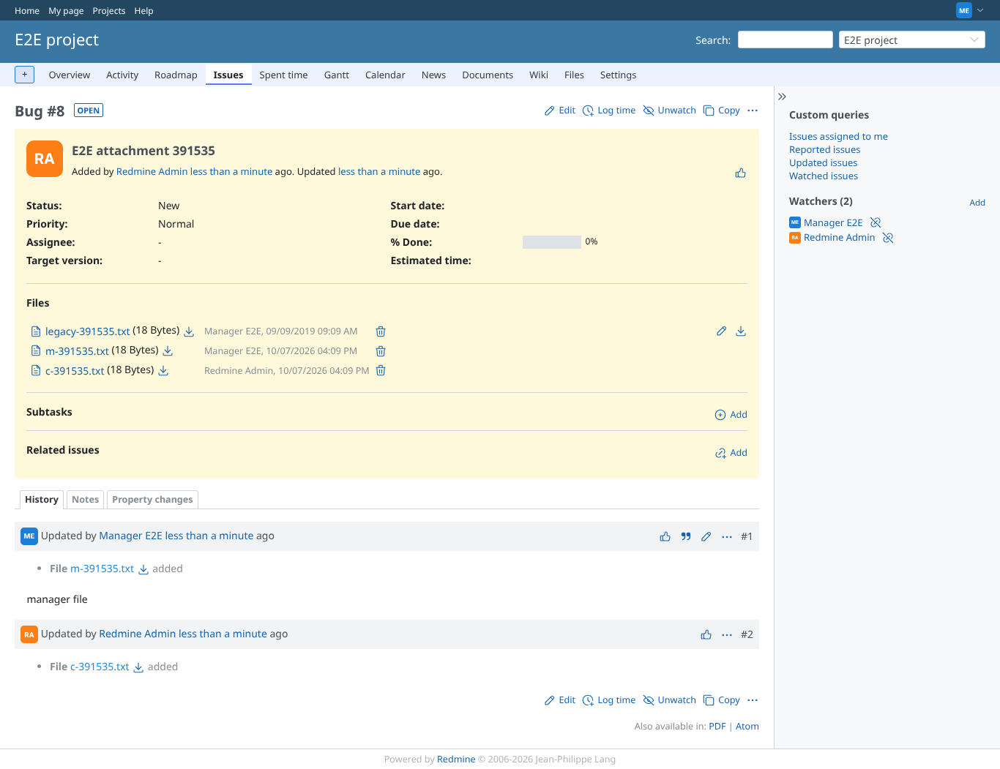

# attachment-overrides

Run 2026-10-07T16:09:59.521Z against http://127.0.0.1:3000.

| screenshot | user | URL | shows |
|---|---|---|---|
|  | admin | `/settings?tab=integrations` | Admin uploads a file with author manager and a 2019 date, attaches it to a new issue; the attachment keeps both |
|  | admin | `/issues/8` | The issue page lists the attachment by Manager E2E, dated 2019 |
|  | admin | `/issues/8` | Manager (no admin) and the core path /uploads.json: the overrides are ignored, the uploader and today are kept |
|  | admin | `/issues/8` | Refusals: unparseable created_on and unknown author (422, no file stored), anonymous (401); outsider may upload like on the core path |
|  | manager | `/issues/8` | Seen by manager: the imported file by Manager E2E (2019), his own and the core upload with today |
