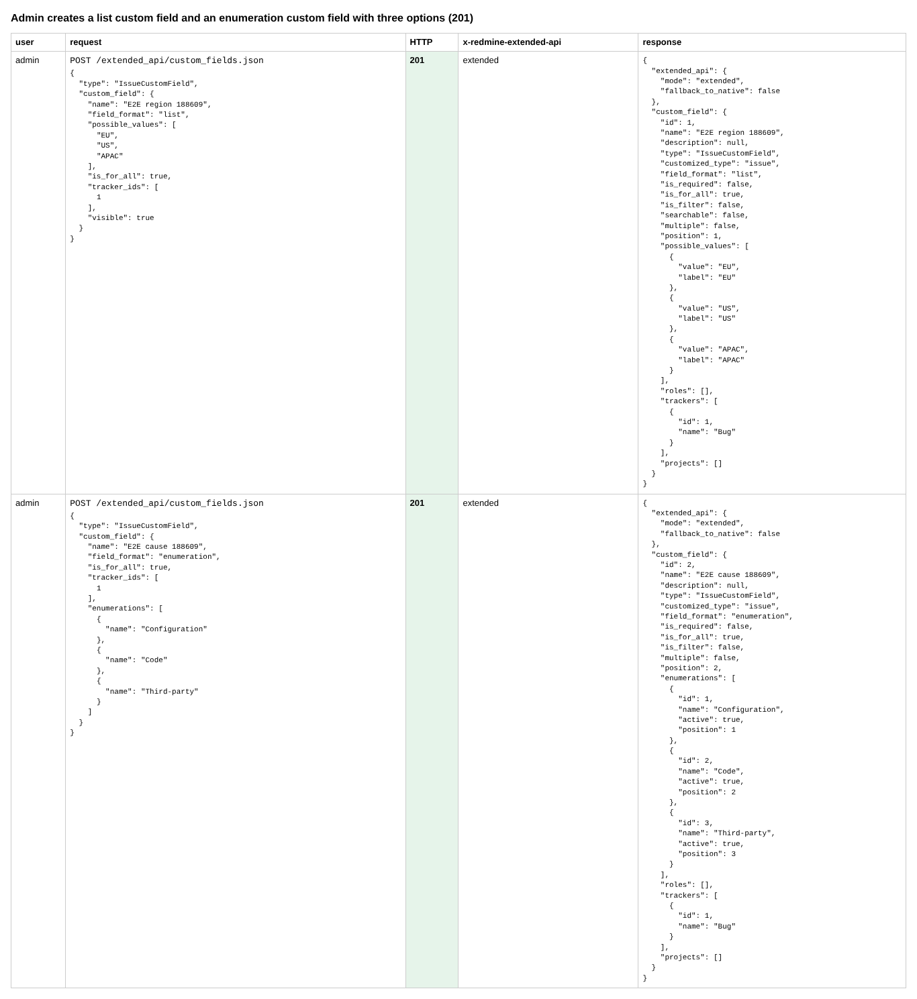
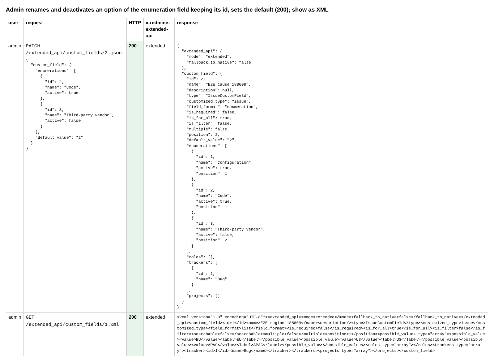
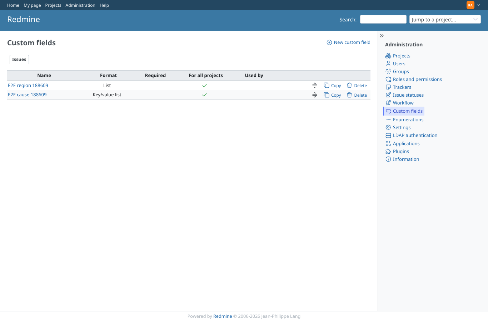
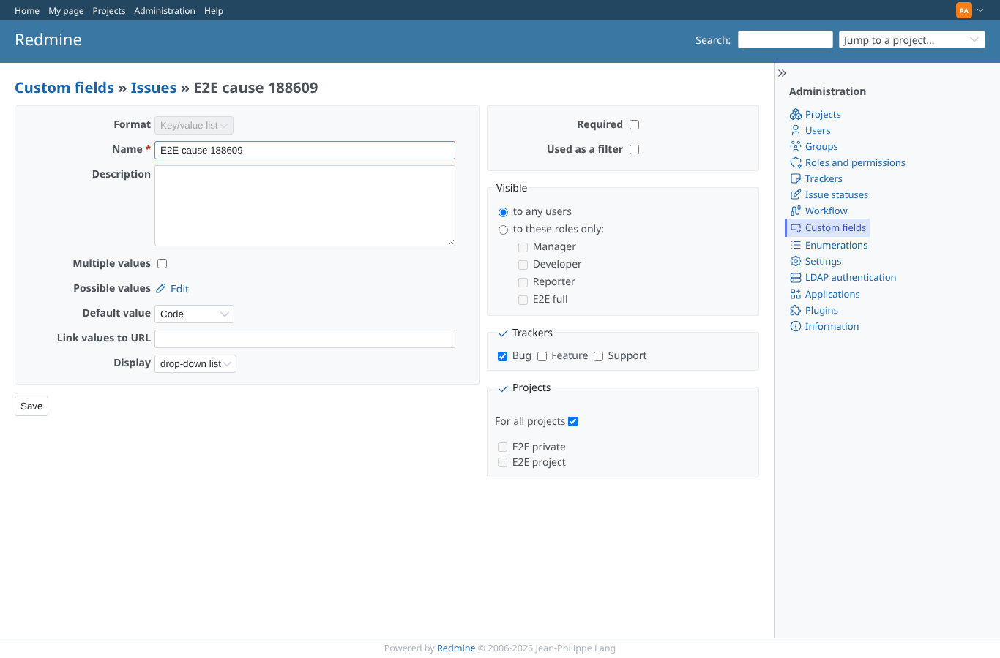
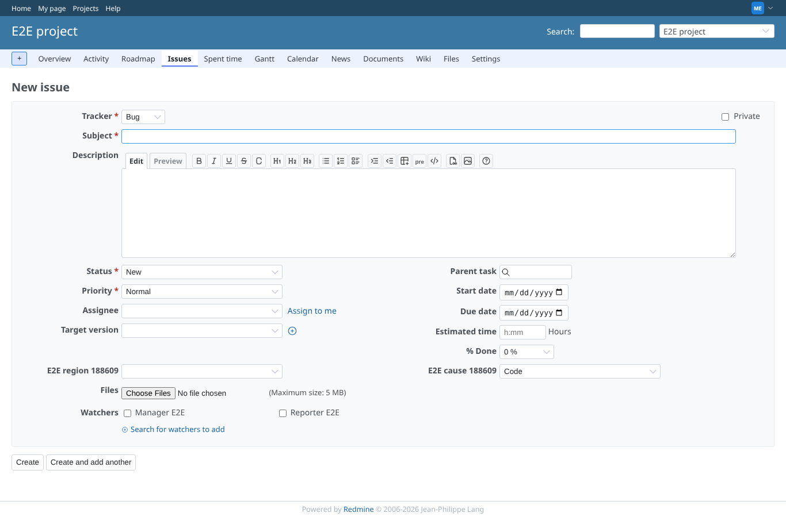
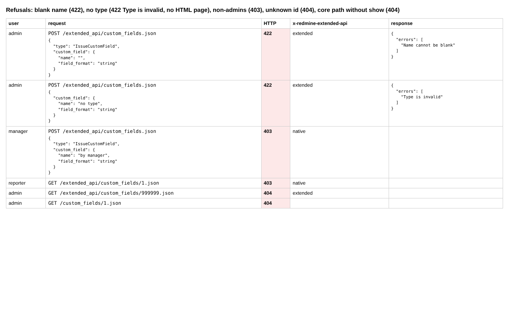
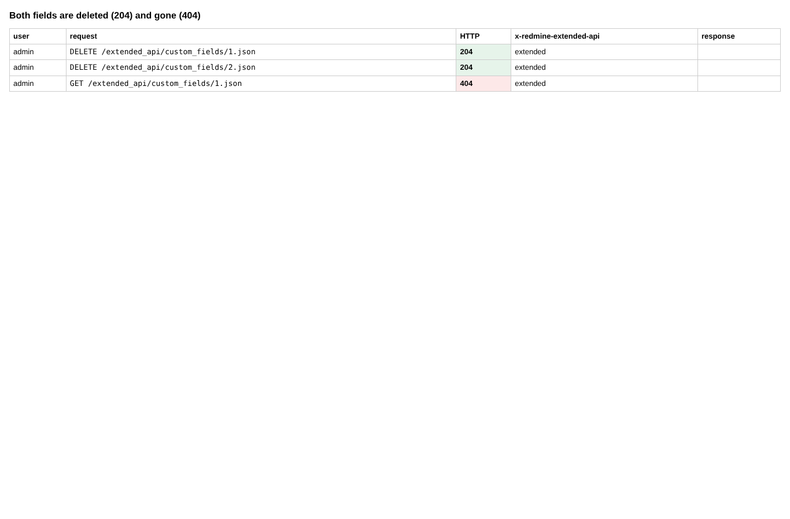

# custom-fields

Run 2026-10-06T20:39:57.855Z against http://127.0.0.1:3000.

| screenshot | user | URL | shows |
|---|---|---|---|
|  | admin | `/settings?tab=integrations` | Admin creates a list custom field and an enumeration custom field with three options (201) |
|  | admin | `/settings?tab=integrations` | Admin renames and deactivates an option of the enumeration field keeping its id, sets the default (200); show as XML |
|  | admin | `/custom_fields?tab=IssueCustomField` | Administration > Custom fields lists both fields made through the API |
|  | admin | `/custom_fields/2/edit` | The enumeration field in the admin form: the options and the default set through the API |
|  | manager | `/projects/e2e-project/issues/new?issue[tracker_id]=1` | Both fields are on the new issue form of e2e-project for a member (Bug tracker) |
|  | manager | `/projects/e2e-project/issues/new?issue[tracker_id]=1` | Refusals: blank name (422), no type (422 Type is invalid, no HTML page), non-admins (403), unknown id (404), core path without show (404) |
|  | manager | `/projects/e2e-project/issues/new?issue[tracker_id]=1` | Both fields are deleted (204) and gone (404) |
