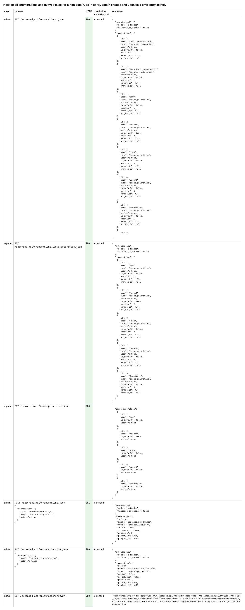
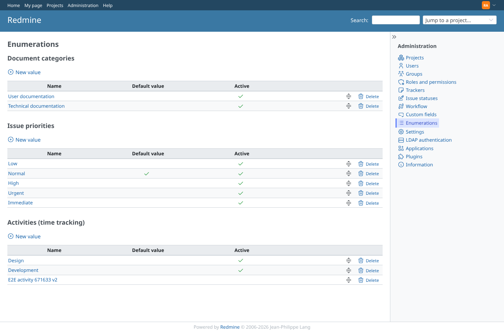
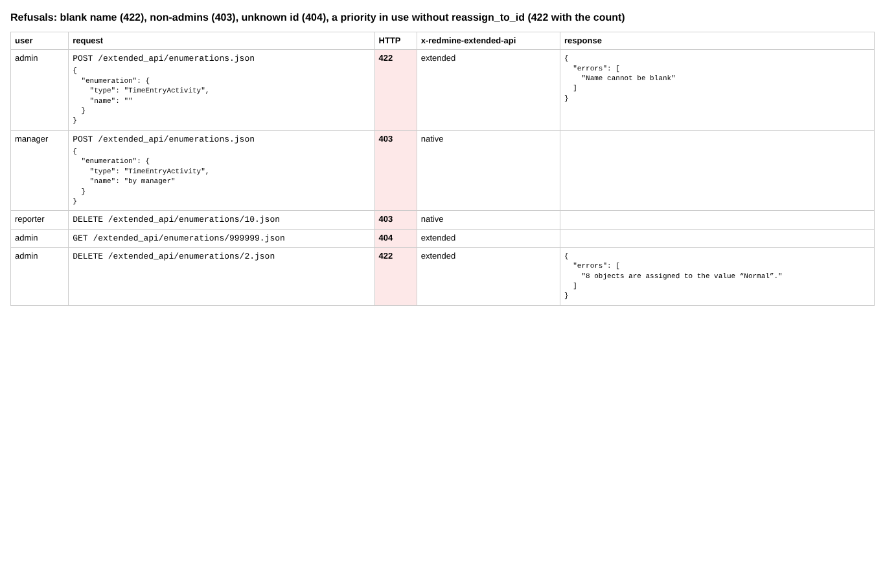
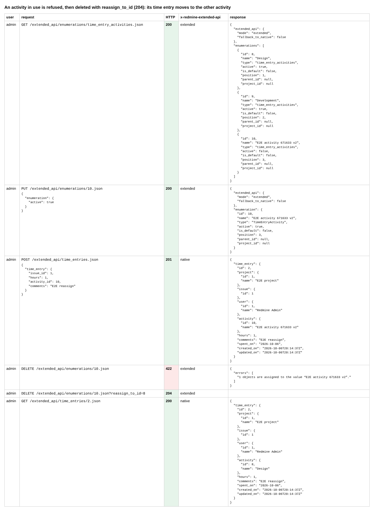

# enumerations

Run 2026-10-06T20:14:37.927Z against http://127.0.0.1:3000.

| screenshot | user | URL | shows |
|---|---|---|---|
|  | admin | `/settings?tab=integrations` | Index of all enumerations and by type (also for a non-admin, as in core), admin creates and updates a time entry activity |
|  | admin | `/enumerations` | Administration > Enumerations shows the activity created and deactivated through the API |
|  | admin | `/enumerations` | Refusals: blank name (422), non-admins (403), unknown id (404), a priority in use without reassign_to_id (422 with the count) |
|  | admin | `/enumerations` | An activity in use is refused, then deleted with reassign_to_id (204): its time entry moves to the other activity |
