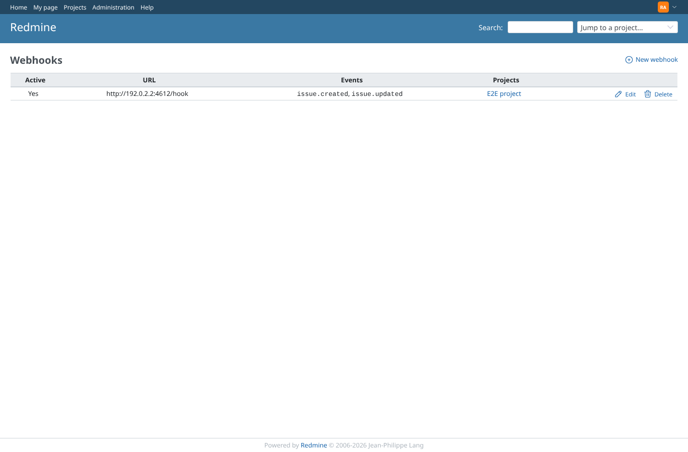
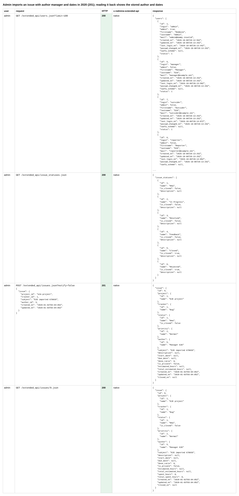
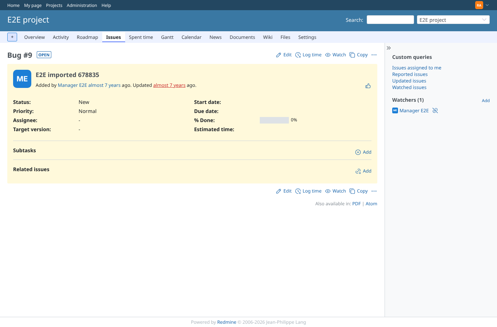
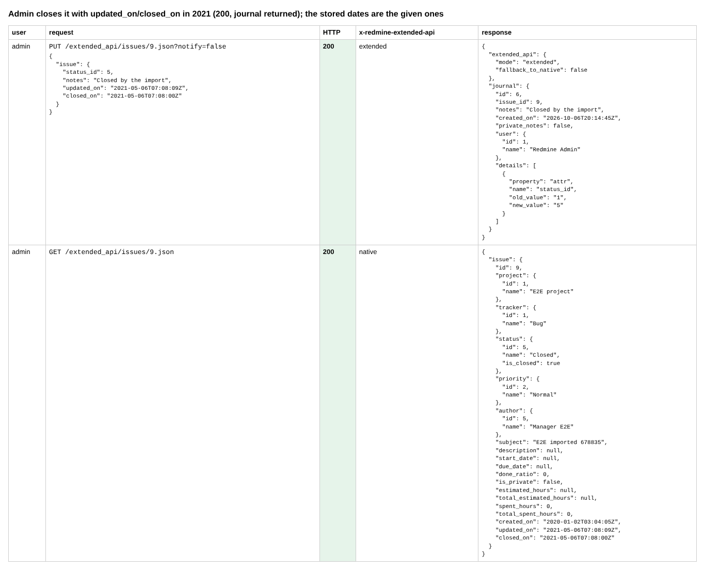
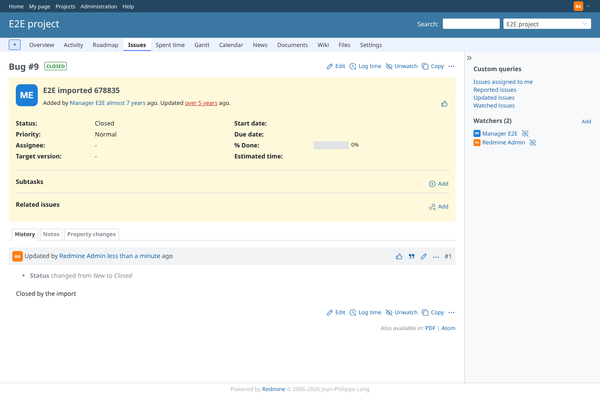
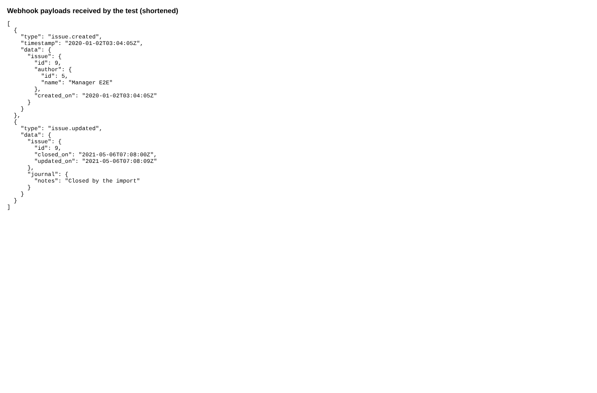
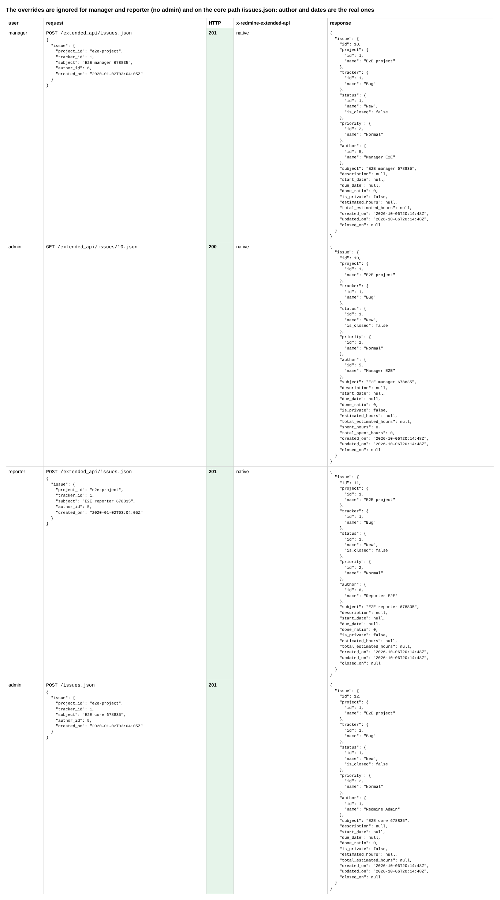
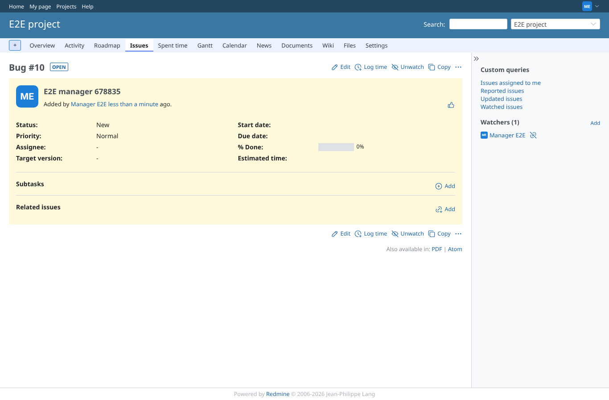
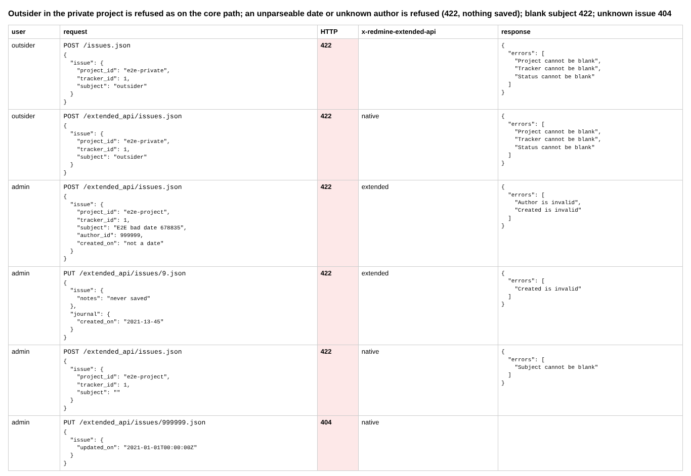

# issue-overrides

Run 2026-10-06T20:14:52.356Z against http://127.0.0.1:3000.

| screenshot | user | URL | shows |
|---|---|---|---|
|  | admin | `/webhooks` | A Redmine 7 webhook for issue created/updated in e2e-project, pointing at a receiver in the test |
|  | admin | `/webhooks` | Admin imports an issue with author manager and dates in 2020 (201); reading it back shows the stored author and dates |
|  | admin | `/issues/9` | The imported issue: "Added by Manager E2E" years ago (created 2020-01-02), not by the admin who posted it |
|  | admin | `/issues/9` | Admin closes it with updated_on/closed_on in 2021 (200, journal returned); the stored dates are the given ones |
|  | admin | `/issues/9` | The issue page after the import update: closed, the note in the history |
|  | admin | `/issues/9` | The webhooks carry the imported author and dates, the same values as stored |
|  | admin | `/issues/9` | The overrides are ignored for manager and reporter (no admin) and on the core path /issues.json: author and dates are the real ones |
|  | manager | `/issues/10` | Issue posted by manager with author_id=reporter and a 2020 date: added by Manager E2E, just now |
|  | manager | `/issues/10` | Outsider in the private project is refused as on the core path; an unparseable date or unknown author is refused (422, nothing saved); blank subject 422; unknown issue 404 |
