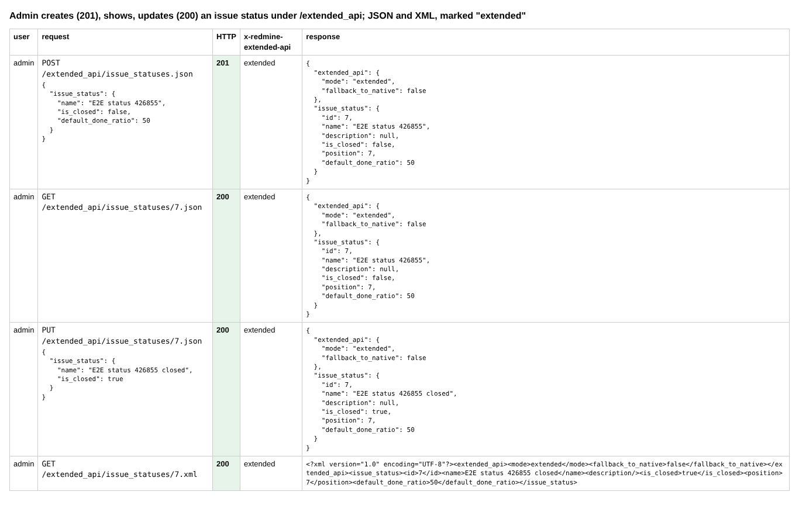
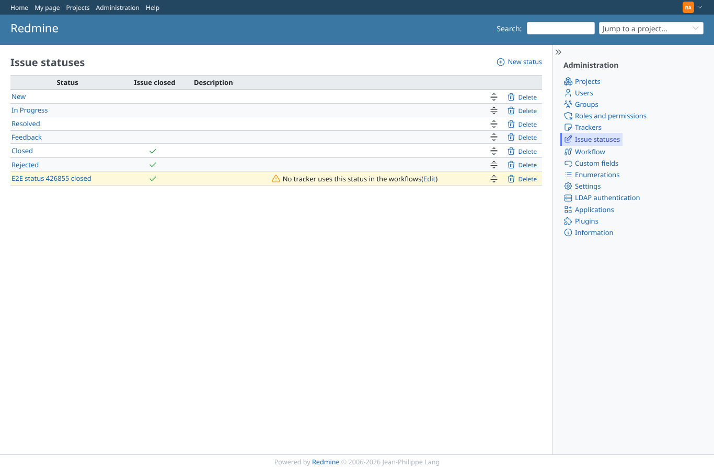
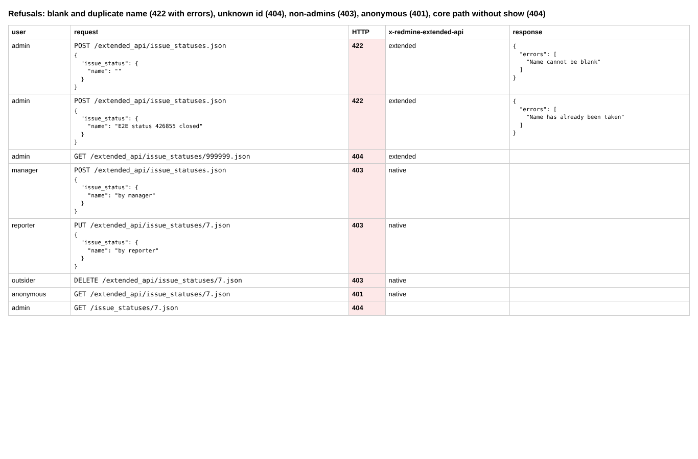
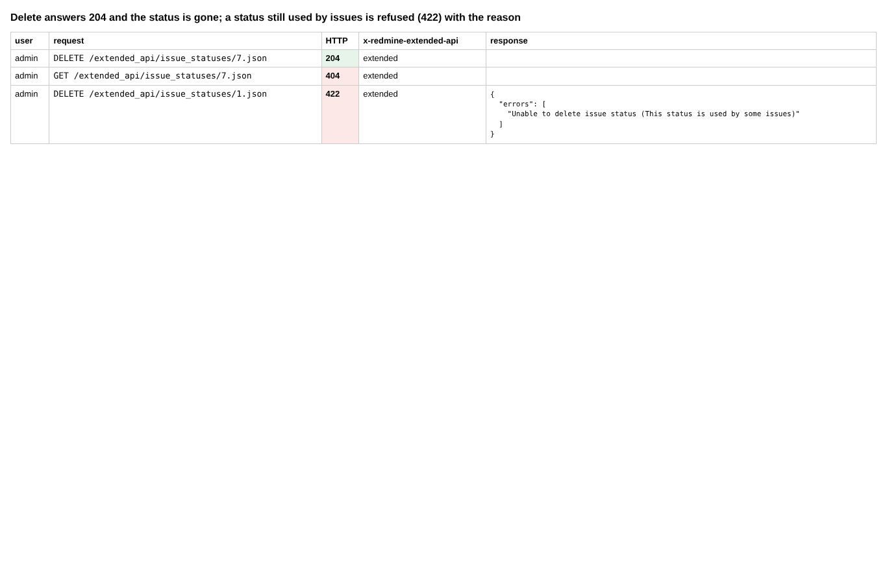

# issue-statuses

Run 2026-10-07T16:10:32.906Z against http://127.0.0.1:3000.

| screenshot | user | URL | shows |
|---|---|---|---|
|  | admin | `/settings?tab=integrations` | Admin creates (201), shows, updates (200) an issue status under /extended_api; JSON and XML, marked "extended" |
|  | admin | `/issue_statuses` | Administration > Issue statuses shows the status created and closed through the API |
|  | admin | `/issue_statuses` | Refusals: blank and duplicate name (422 with errors), unknown id (404), non-admins (403), anonymous (401), core path without show (404) |
|  | admin | `/issue_statuses` | Delete answers 204 and the status is gone; a status still used by issues is refused (422) with the reason |
