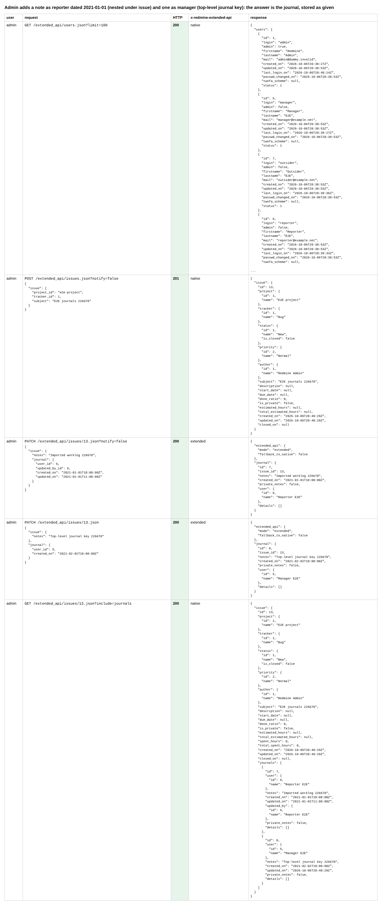
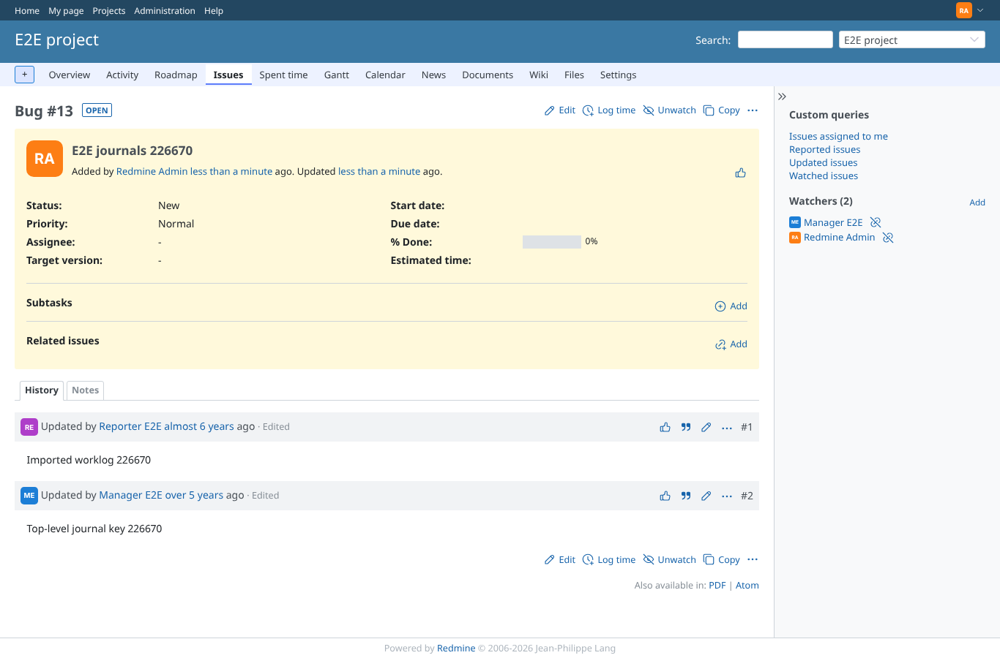
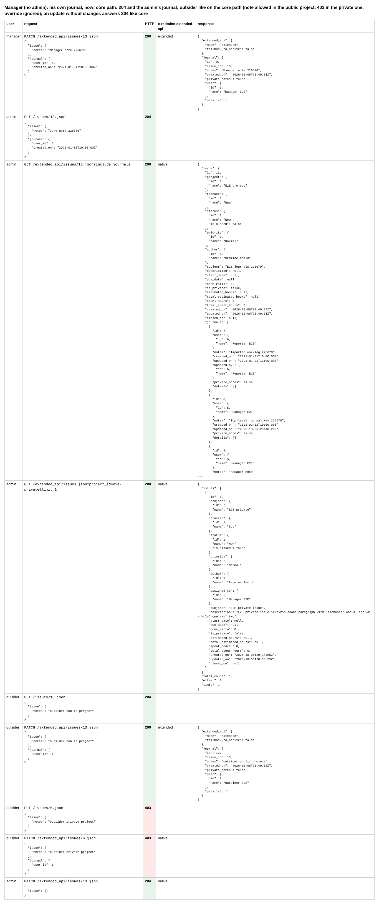
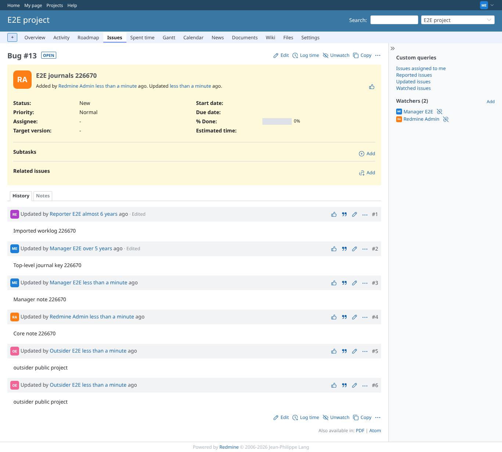

# journal-overrides

Run 2026-10-06T20:40:35.536Z against http://127.0.0.1:3000.

| screenshot | user | URL | shows |
|---|---|---|---|
|  | admin | `/settings?tab=integrations` | Admin adds a note as reporter dated 2021-01-01 (nested under issue) and one as manager (top-level journal key): the answer is the journal, stored as given |
|  | admin | `/issues/13` | The issue history: the imported notes by Reporter E2E and Manager E2E, years ago, though the admin posted them |
|  | admin | `/issues/13` | Manager (no admin): his own journal, now; core path: 204 and the admin's journal; outsider like on the core path (note allowed in the public project, 403 in the private one, override ignored); an update without changes answers 204 like core |
|  | manager | `/issues/13` | The same history seen by a member: imported notes keep their user and date, the manager's own note is "just now" |
