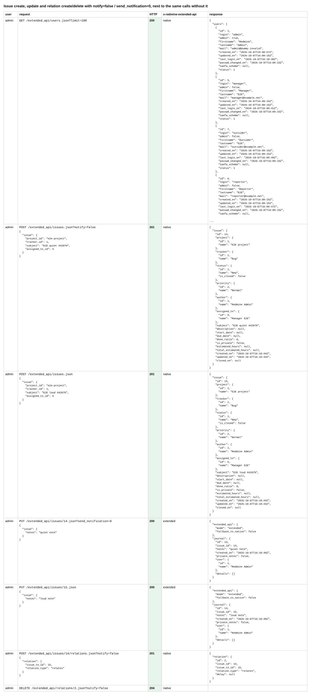
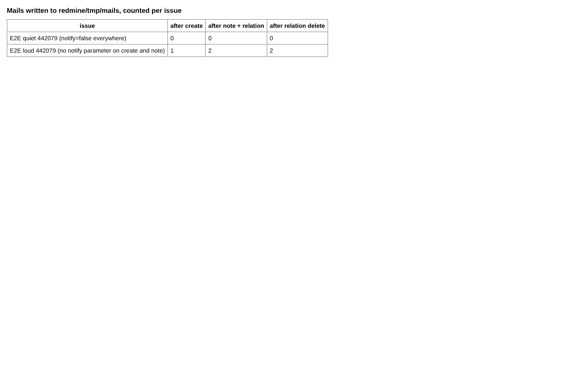
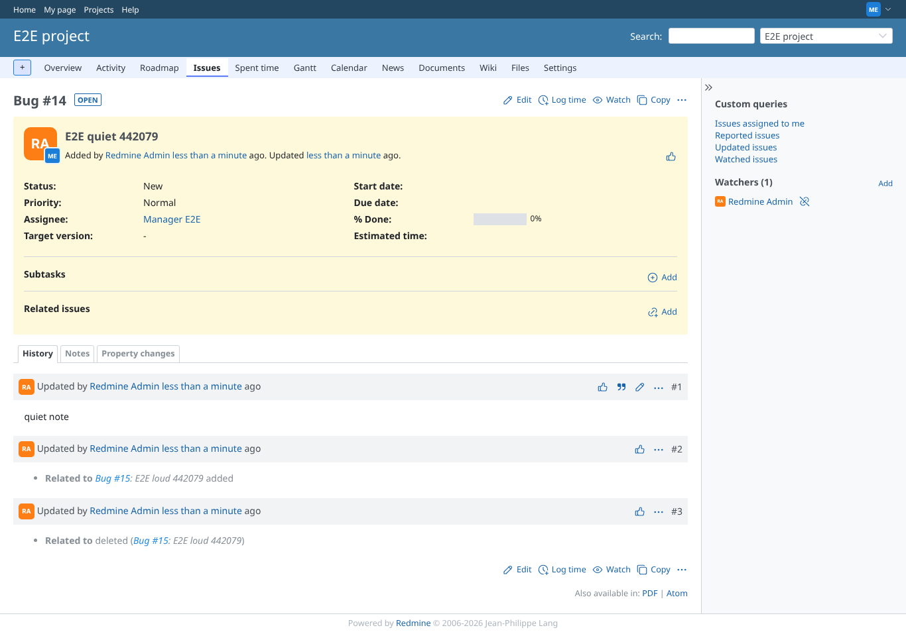

# notifications

Run 2026-10-07T16:10:59.506Z against http://127.0.0.1:3000.

| screenshot | user | URL | shows |
|---|---|---|---|
|  | admin | `/settings?tab=integrations` | Issue create, update and relation create/delete with notify=false / send_notification=0, next to the same calls without it |
|  | admin | `/settings?tab=integrations` | No mail at all for the issue handled with notify=false; the other one mails on create and on its note only |
|  | manager | `/issues/14` | The quiet issue as the assignee sees it: created, noted and related without a mail |
