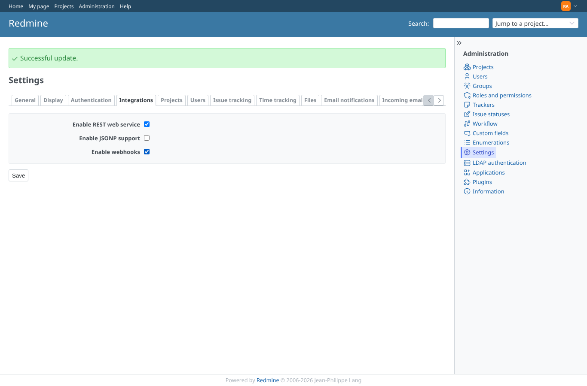
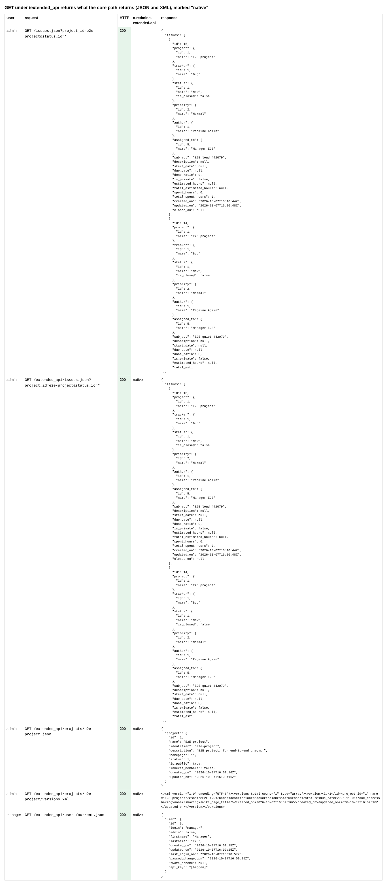
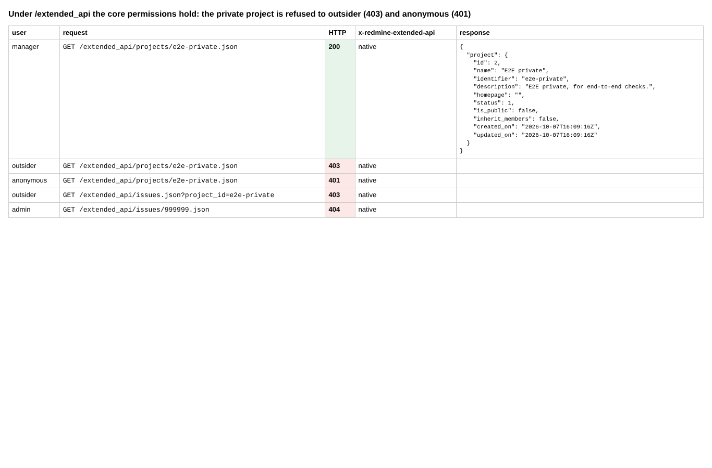
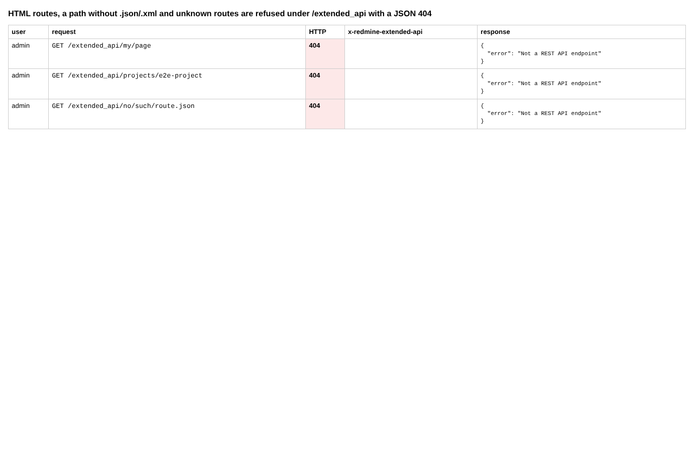
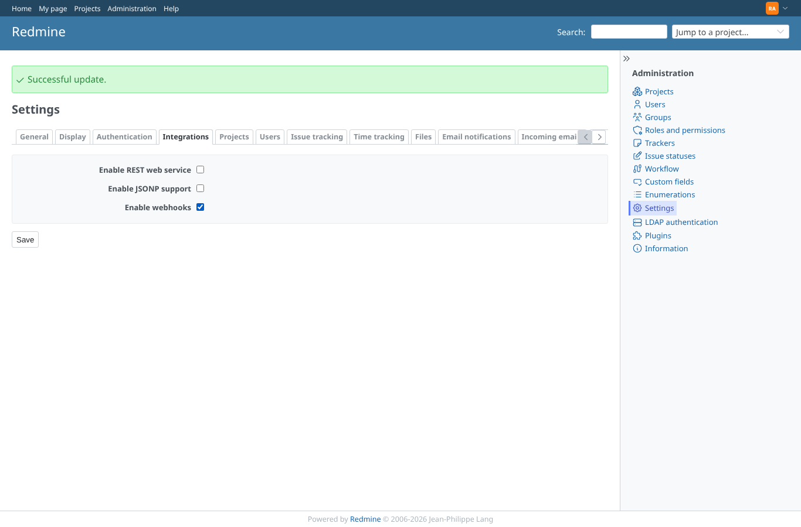
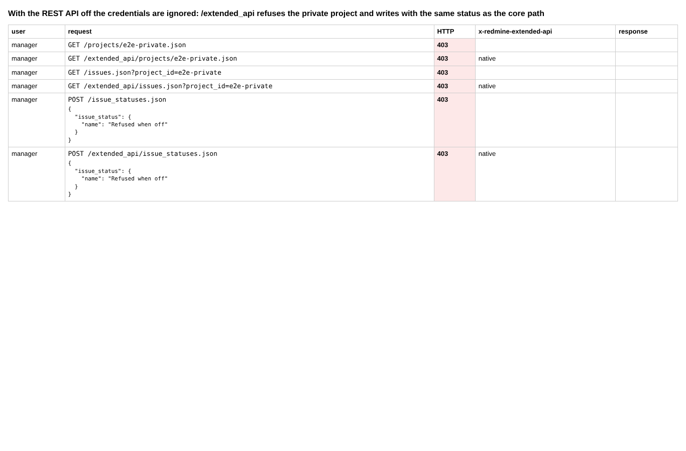

# proxy

Run 2026-10-07T16:11:10.517Z against http://127.0.0.1:3000.

| screenshot | user | URL | shows |
|---|---|---|---|
|  | admin | `/settings?tab=integrations` | Administration > Settings > Integrations: REST API turned on through the form |
|  | admin | `/settings?tab=integrations` | GET under /extended_api returns what the core path returns (JSON and XML), marked "native" |
|  | admin | `/settings?tab=integrations` | Under /extended_api the core permissions hold: the private project is refused to outsider (403) and anonymous (401) |
|  | admin | `/settings?tab=integrations` | HTML routes, a path without .json/.xml and unknown routes are refused under /extended_api with a JSON 404 |
|  | admin | `/settings?tab=integrations` | REST API turned off |
|  | admin | `/settings?tab=integrations` | With the REST API off the credentials are ignored: /extended_api refuses the private project and writes with the same status as the core path |
