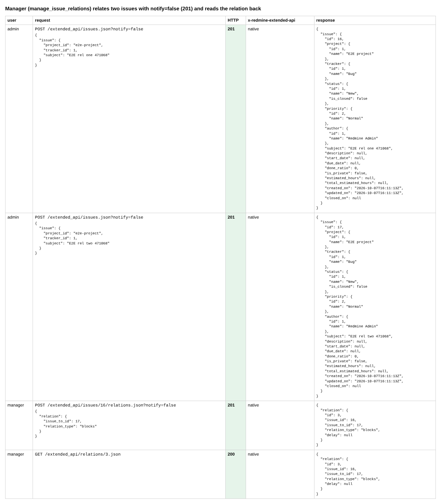
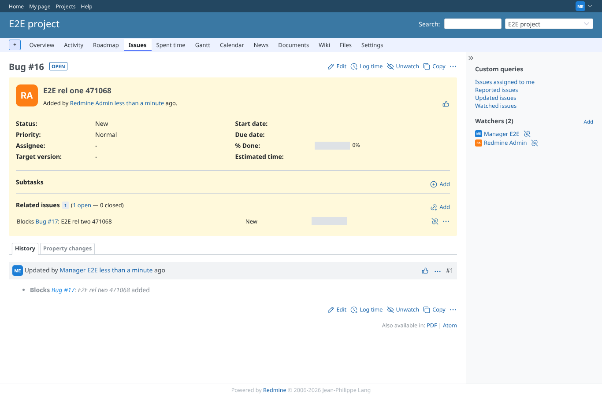
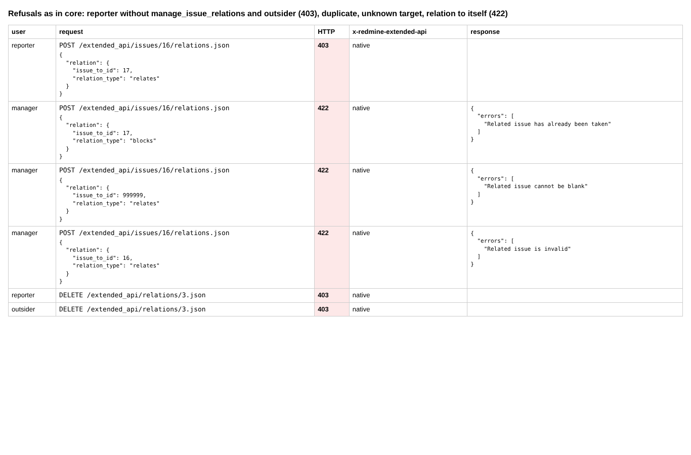
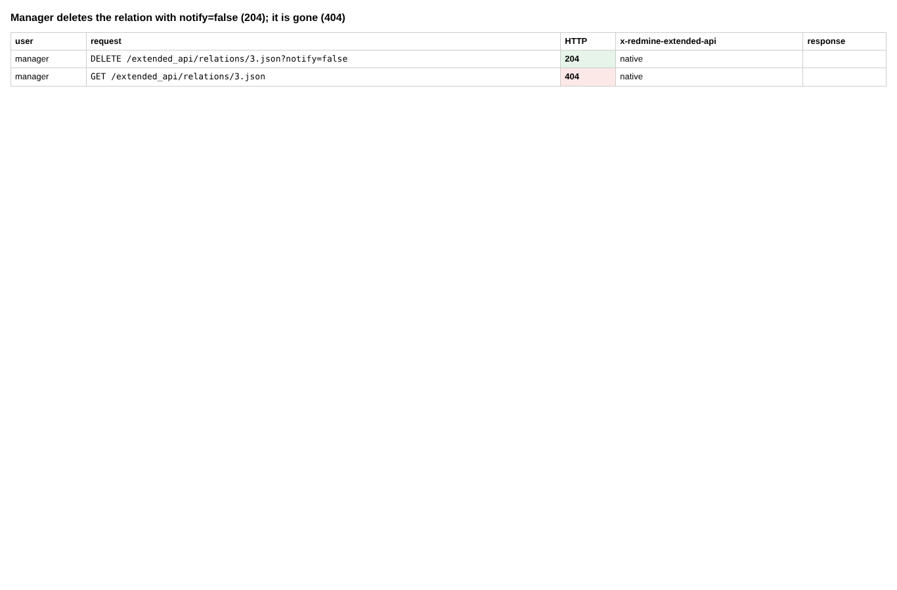
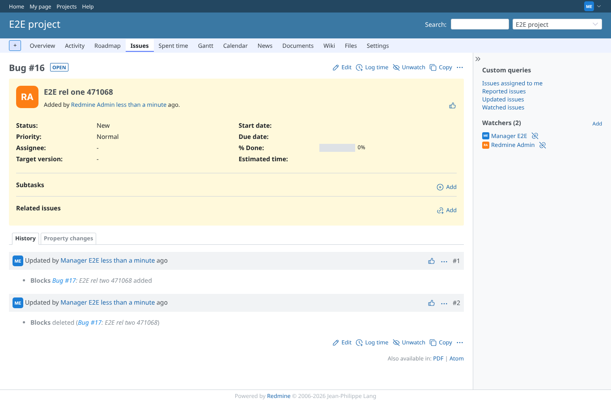

# relations

Run 2026-10-07T16:11:18.684Z against http://127.0.0.1:3000.

| screenshot | user | URL | shows |
|---|---|---|---|
|  | admin | `/settings?tab=integrations` | Manager (manage_issue_relations) relates two issues with notify=false (201) and reads the relation back |
|  | manager | `/issues/16` | The issue page shows "Blocks" the other issue |
|  | manager | `/issues/16` | Refusals as in core: reporter without manage_issue_relations and outsider (403), duplicate, unknown target, relation to itself (422) |
|  | manager | `/issues/16` | Manager deletes the relation with notify=false (204); it is gone (404) |
|  | manager | `/issues/16` | The issue page after the delete: no related issues left, the history shows add and delete of the relation |
