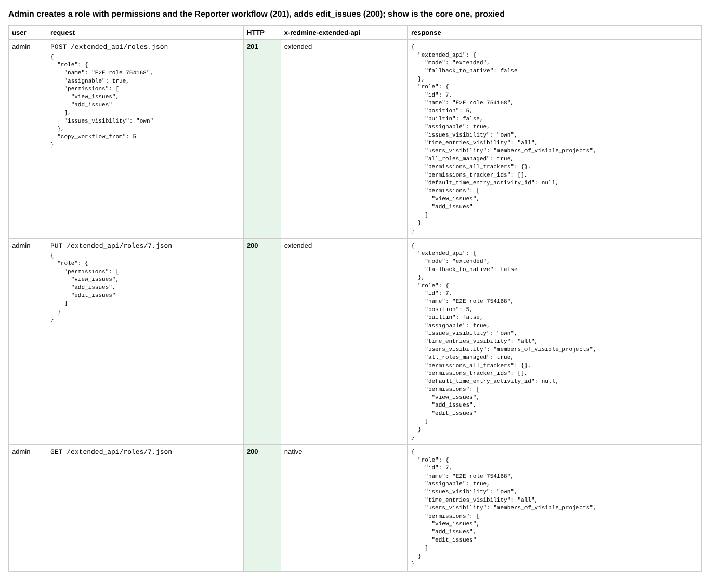
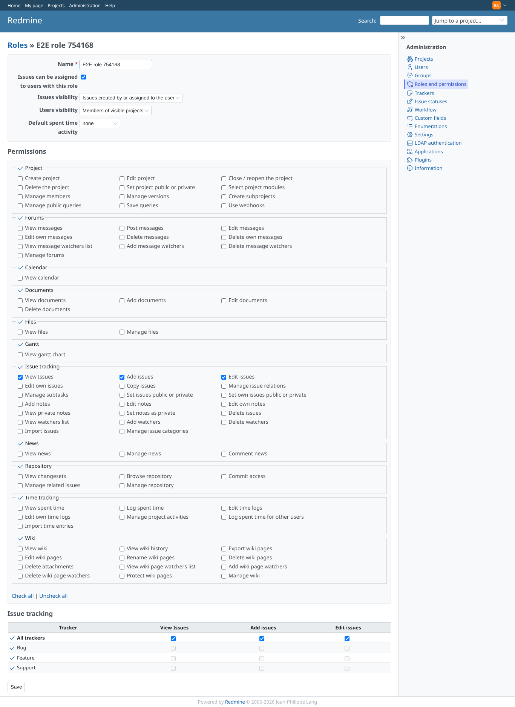
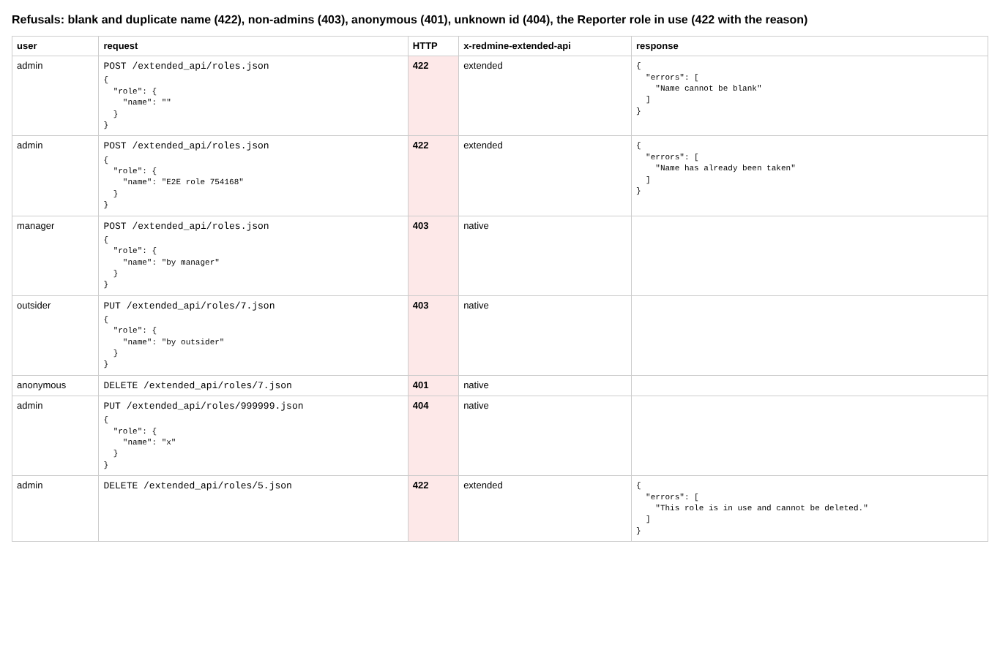
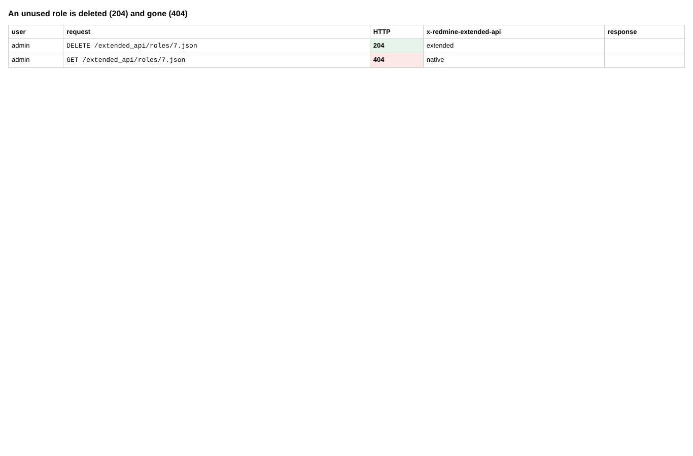

# roles

Run 2026-10-06T20:16:00.228Z against http://127.0.0.1:3000.

| screenshot | user | URL | shows |
|---|---|---|---|
|  | admin | `/settings?tab=integrations` | Admin creates a role with permissions and the Reporter workflow (201), adds edit_issues (200); show is the core one, proxied |
|  | admin | `/roles/7/edit` | Administration > Roles: the role made through the API, with View/Add/Edit issues ticked |
|  | admin | `/roles/7/edit` | Refusals: blank and duplicate name (422), non-admins (403), anonymous (401), unknown id (404), the Reporter role in use (422 with the reason) |
|  | admin | `/roles/7/edit` | An unused role is deleted (204) and gone (404) |
