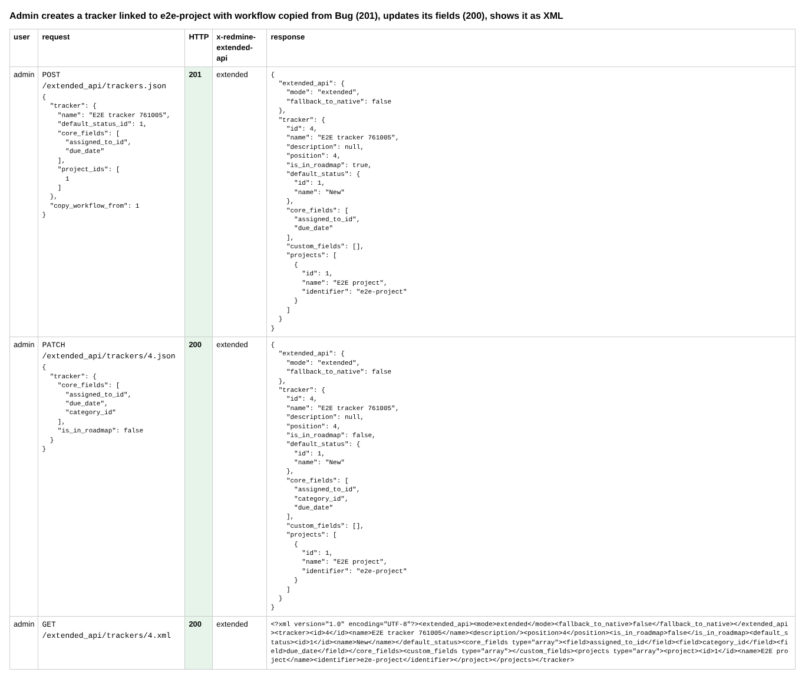
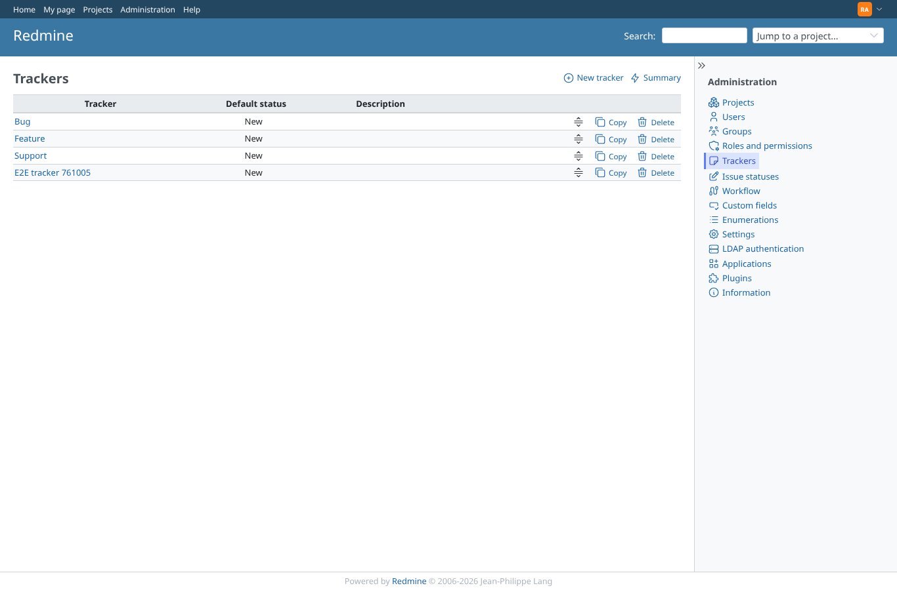
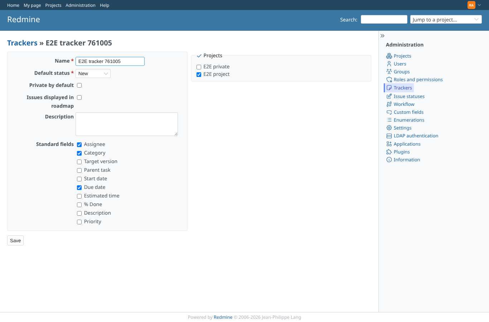
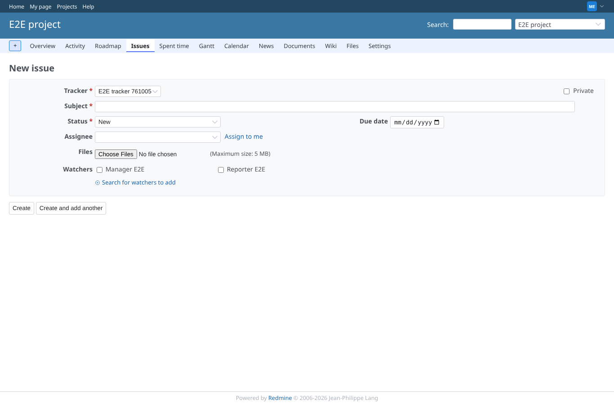
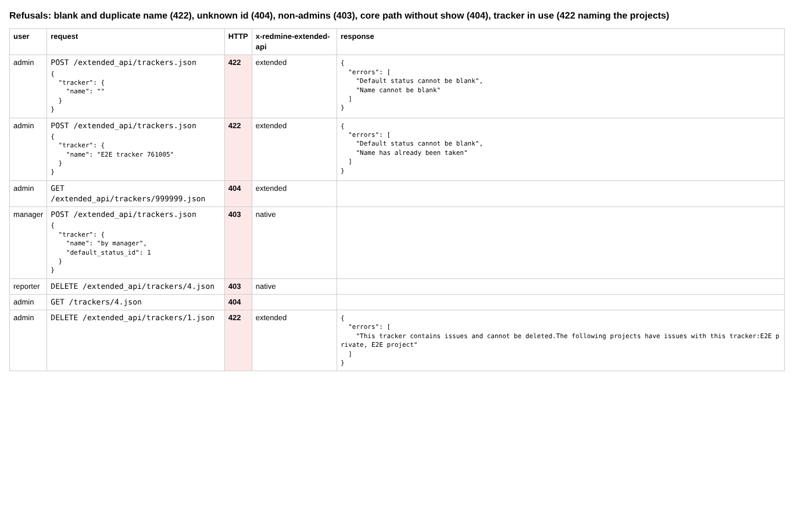
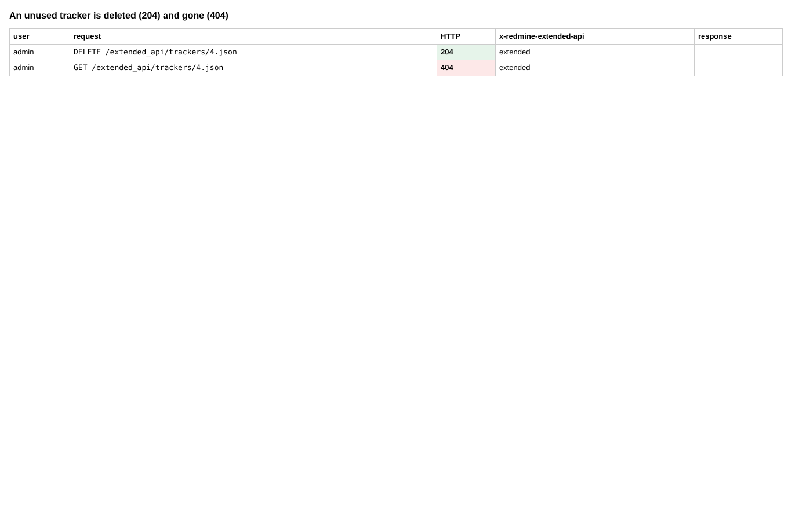

# trackers

Run 2026-10-06T20:16:10.260Z against http://127.0.0.1:3000.

| screenshot | user | URL | shows |
|---|---|---|---|
|  | admin | `/settings?tab=integrations` | Admin creates a tracker linked to e2e-project with workflow copied from Bug (201), updates its fields (200), shows it as XML |
|  | admin | `/trackers` | Administration > Trackers lists the tracker created through the API |
|  | admin | `/trackers/4/edit` | Its edit form: the standard fields and the project set through the API |
|  | manager | `/projects/e2e-project/issues/new` | A member of e2e-project picks the new tracker: the form shows only the standard fields set through the API (assignee, due date) |
|  | manager | `/projects/e2e-project/issues/new` | Refusals: blank and duplicate name (422), unknown id (404), non-admins (403), core path without show (404), tracker in use (422 naming the projects) |
|  | manager | `/projects/e2e-project/issues/new` | An unused tracker is deleted (204) and gone (404) |
