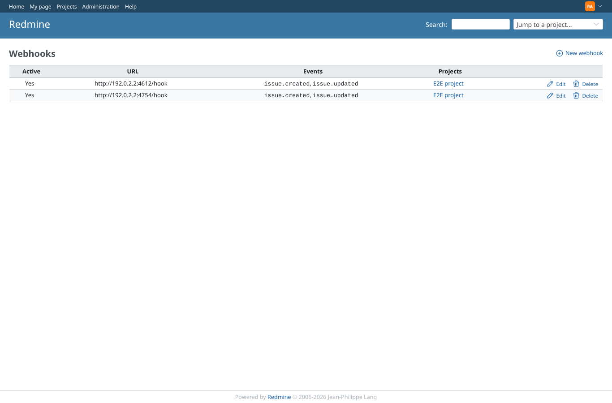
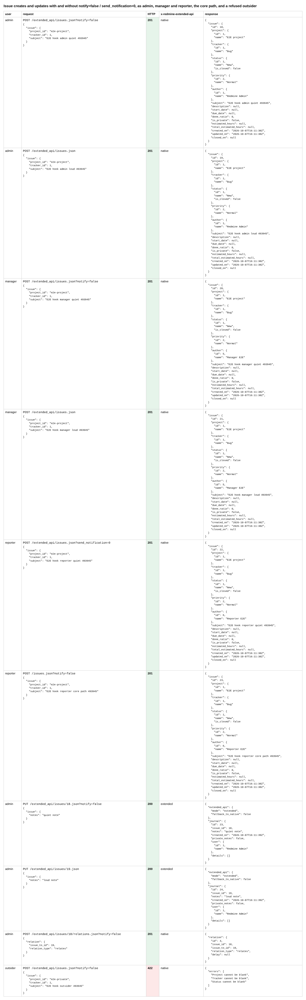
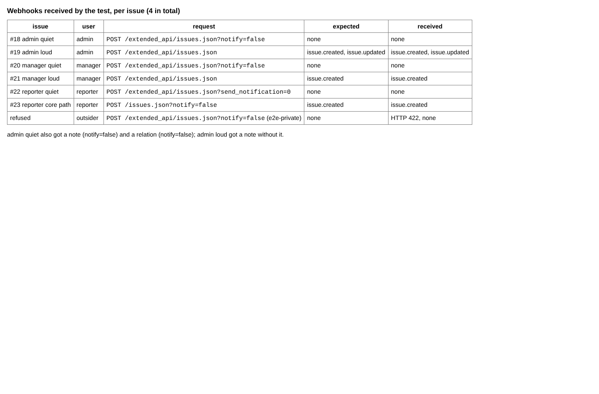
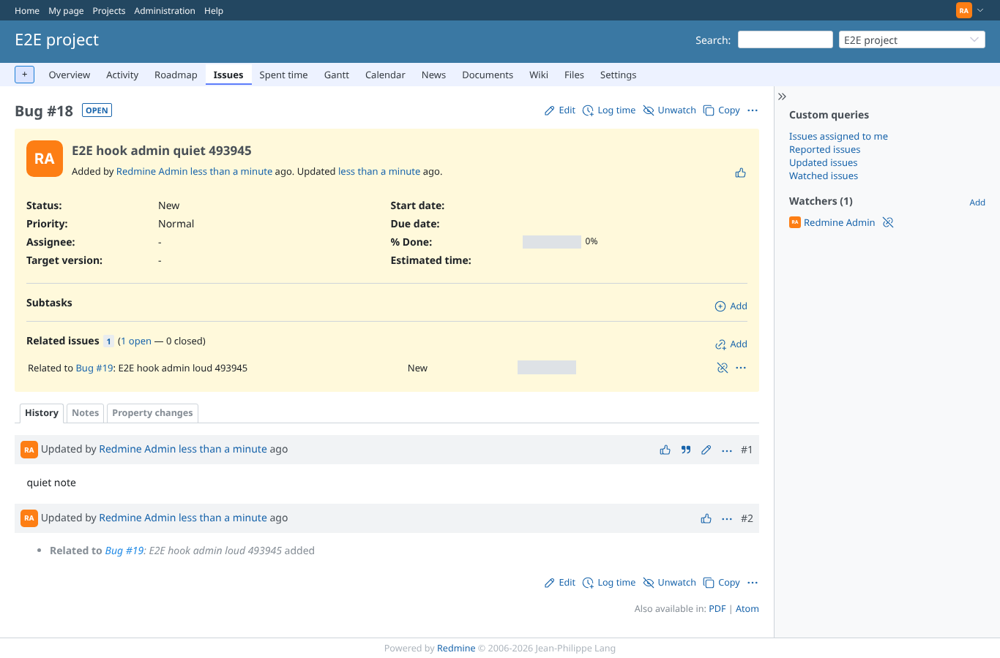

# webhooks

Run 2026-10-07T16:11:45.383Z against http://127.0.0.1:3000.

| screenshot | user | URL | shows |
|---|---|---|---|
|  | admin | `/webhooks` | A Redmine 7 webhook for issue created/updated in e2e-project, pointing at a receiver in the test |
|  | admin | `/webhooks` | Issue creates and updates with and without notify=false / send_notification=0, as admin, manager and reporter, the core path, and a refused outsider |
|  | admin | `/webhooks` | notify=false and send_notification=0 send no webhook for any user; without them, and on the core path, the webhooks arrive |
|  | admin | `/issues/18` | The quiet issue exists with its note and relation; no webhook was sent for any of it |
